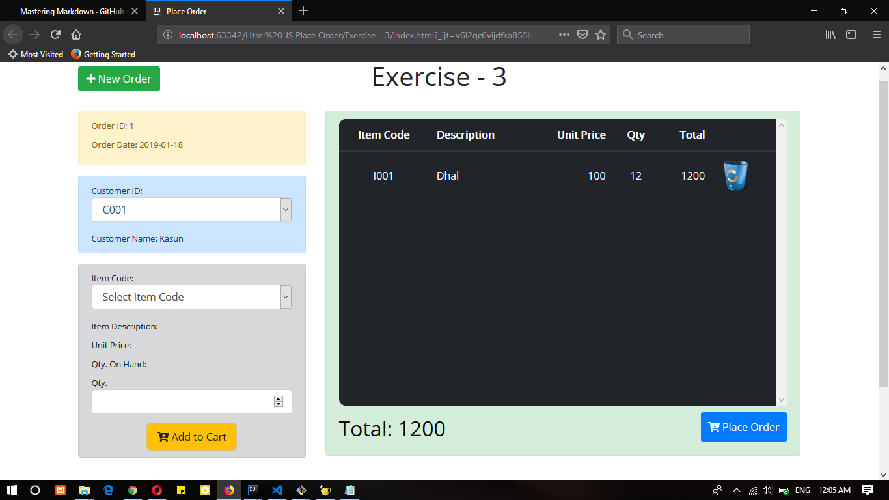
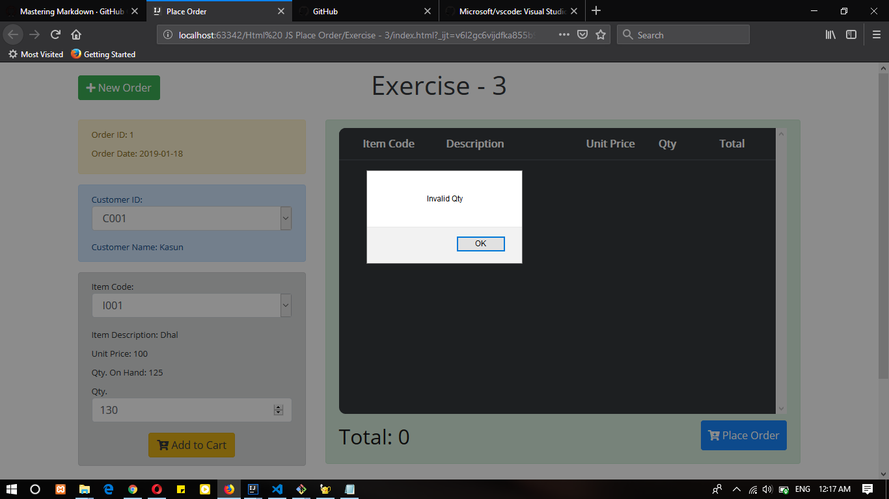
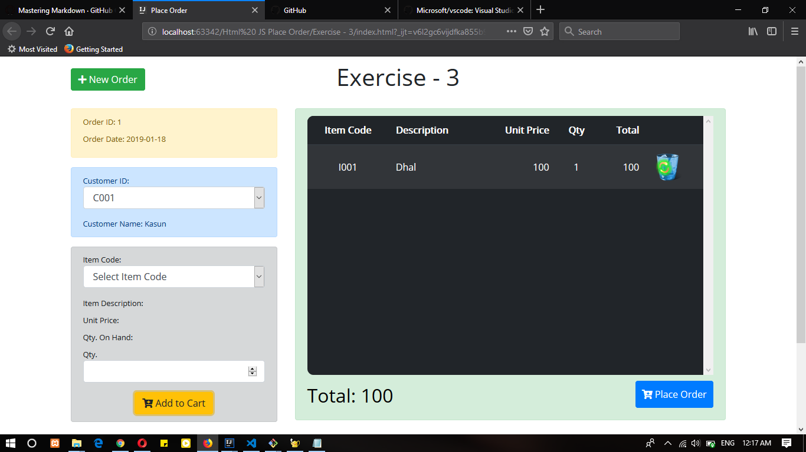
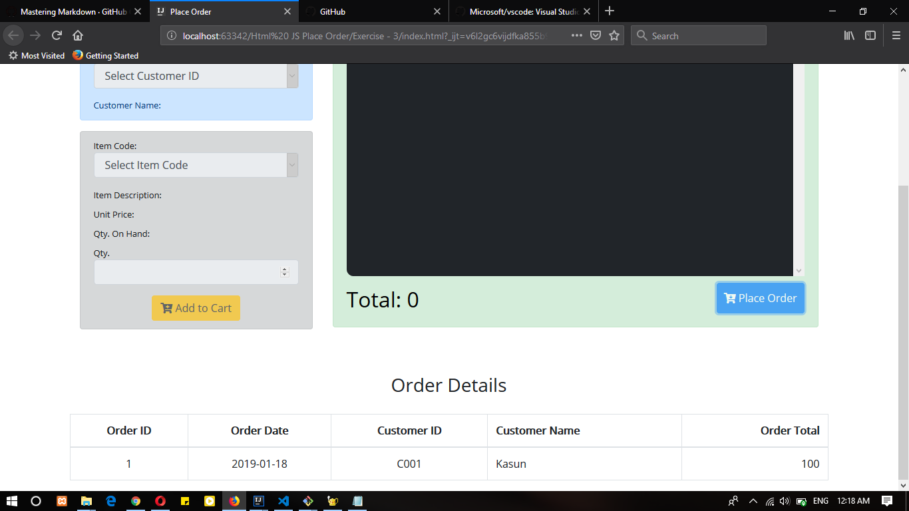
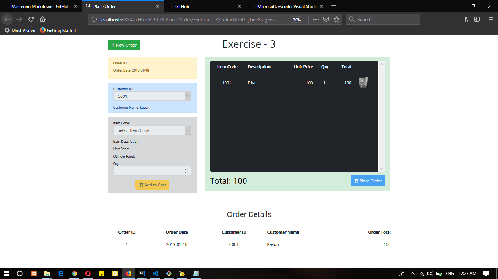

#POS system **Place Order** Form
`This Place Order Form Create the Dynamicly Store the data run time Only.`

_POS System View Given bellow :_ 

#####View 01

#####View 02

#####View 03

#####View 04

#####View 05

###Functionality This Project

* Auto Generate OrderID
* Add to cart Items
* Remove the cart selected Item
* Update Cart Item qty
* Select Item & Customer Details Add Order Details
* Order Details Click and get the all Record Order ID

###Feedback
* Ask a question on Stack Overflow.
* Request a new feature on GitHub.

###Bundled Extensions

This Project crete the using programming language are HTML5 | CSS 3 | ECMASCRIPT | Booststrap.

###Copyright
LahiruSasanka (c) DEP IJSE 2019